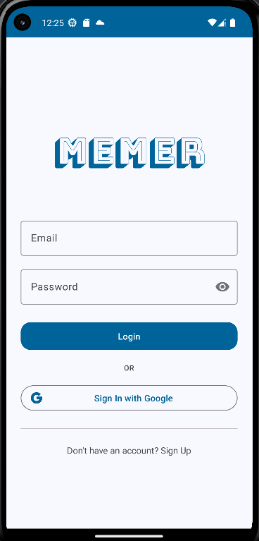
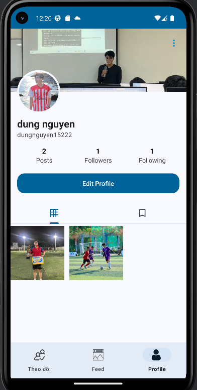

# Chạm - Ứng dụng Mạng xã hội Android

Đây là một dự án ứng dụng mạng xã hội (MXH) dành cho nền tảng Android, được xây dựng bằng Java. Ứng dụng có tên là **Chạm**, mô phỏng các tính năng cơ bản của một mạng xã hội hình ảnh, sử dụng Firebase làm backend để quản lý dữ liệu và người dùng.

## Demo

*(Bạn có thể chèn ảnh chụp màn hình hoặc GIF demo các chức năng của ứng dụng tại đây)*

| Trang Đăng nhập | Trang Feed | Trang Profile |
| :---: | :---: | :---: |
| ** | ** | ** |

## Tính năng chính

#### 1. Hệ thống người dùng
- [x] Đăng ký, Đăng nhập tài khoản.
- [x] Chỉnh sửa thông tin cá nhân (tên, ảnh đại diện, ảnh bìa, bio).
- [x] Theo dõi (Follow) và Bỏ theo dõi (Unfollow) người dùng khác.
- [x] Xem danh sách người theo dõi và đang theo dõi.

#### 2. Bài viết (Post)
- [x] Tạo bài viết mới với hình ảnh và mô tả.
- [x] Chỉnh sửa mô tả của bài viết đã đăng.
- [x] Xóa bài viết (chỉ chủ nhân bài viết có thể xóa).
- [x] Lưu bài viết vào danh sách cá nhân.
- [x] Hiển thị bài viết trên trang Feed chính.

#### 3. Tương tác xã hội
- [x] **Thích / Bỏ thích** một bài viết.
- [x] **Bình luận** vào một bài viết.
- [x] **Thích / Bỏ thích** một bình luận.
- [x] **Xóa bình luận** (chủ nhân bình luận hoặc chủ nhân bài viết có thể xóa).

#### 4. Thông báo (Notification)
- [x] Nhận thông báo khi có người theo dõi mới.
- [x] Nhận thông báo khi có người bình luận vào bài viết.
- [x] Nhận thông báo khi có người thích bình luận của mình.
- [x] Trang xem danh sách các thông báo, điều hướng đến bài viết liên quan.

#### 5. Giao diện & Trải nghiệm người dùng
- [x] Giao diện Profile với ảnh bìa, ảnh đại diện và các chỉ số (bài viết, followers, following).
- [x] Thanh điều hướng dưới (Bottom Navigation) để chuyển qua lại các màn hình chính.
- [x] Sửa lỗi điều hướng khi xem trang cá nhân của người khác và lỗi bị "kẹt" màn hình.
- [x] Cải thiện UI/UX cho các nút bấm (nút Options).

## Công nghệ sử dụng

*   **Ngôn ngữ**: Java
*   **Nền tảng**: Android
*   **Backend & Cơ sở dữ liệu**: 
    *   Firebase Authentication (Xác thực người dùng)
    *   Firebase Firestore (Cơ sở dữ liệu NoSQL)
    *   Firebase Storage (Lưu trữ file, hình ảnh)
*   **Kiến trúc & Thư viện chính**: 
    *   AndroidX (AppCompat, ConstraintLayout, RecyclerView)
    *   Navigation Component (Quản lý luồng di chuyển trong ứng dụng)
    *   ViewBinding
    *   Material Design Components
    *   [Glide](https://github.com/bumptech/glide): Thư viện tải và hiển thị hình ảnh.
    *   [CircleImageView](https://github.com/hdodenhof/CircleImageView): Hiển thị ảnh đại diện dạng tròn.

## Hướng dẫn cài đặt

1.  **Clone Repository**:
    ```bash
    git clone https://github.com/quochuy171105/MXHApp-Project.git
    ```

2.  **Mở trong Android Studio**:
    - Mở Android Studio và chọn "Open an existing project".
    - Trỏ đến thư mục dự án bạn vừa clone.

3.  **Kết nối với Firebase (Quan trọng)**:
    - Đây là dự án sử dụng Firebase, bạn cần tạo một dự án Firebase của riêng mình.
    - **Bước 1**: Truy cập [Firebase Console](https://console.firebase.google.com/), tạo một dự án mới.
    - **Bước 2**: Trong dự án Firebase, thêm một ứng dụng Android với package name là `huynguyen.com.MXHApp`.
    - **Bước 3**: Tải file `google-services.json` mà Firebase cung cấp.
    - **Bước 4**: Chép file `google-services.json` vừa tải vào thư mục `app` của dự án trong Android Studio.
    - **Bước 5**: Trong Firebase Console, hãy bật các dịch vụ: **Authentication** (với phương thức Email/Password), **Firestore**, và **Storage**.

4.  **Build và chạy ứng dụng**:
    - Đồng bộ Gradle và chạy ứng dụng trên máy ảo hoặc thiết bị thật.

## Tác giả

*Nguyễn Quốc Huy*
